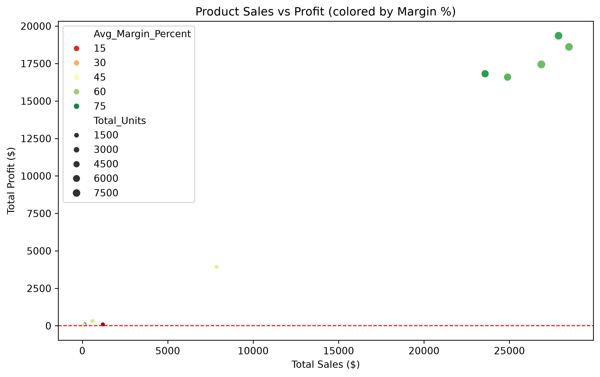

# Nassau Candy Distributor - Profitability & Margin Analysis

## Project Overview

This project analyzes the **Nassau Candy Distributor** product-line dataset to understand sales performance, cost structure, gross profit, gross margin, product profitability, division performance, regional distribution, and profit concentration.

The project is divided into two connected parts:

1. **Exploratory Data Analysis (EDA)** in Jupyter Notebook for data inspection, cleaning, validation, feature engineering, and business analysis.
2. **Streamlit Dashboard** for interactive exploration of the cleaned data, profitability KPIs, product performance, margin risks, and concentration analysis.

### Tools and Technologies

- Python
- Pandas
- NumPy
- Matplotlib
- Seaborn
- Plotly Express
- Jupyter Notebook
- Streamlit

---

# 1. Problem Statement

Sales revenue alone does not provide a complete picture of product performance. A product may generate high sales while producing a relatively low margin, while another product may have a high margin but contribute little total profit because its sales volume is small.

The main problem addressed in this project is:

> **How can the Nassau Candy Distributor dataset be explored and transformed into meaningful profitability insights that identify strong products, weak products, margin issues, and areas where management should focus pricing, cost control, inventory, and product strategy?**

The analysis focuses on the following business questions:

- Which products generate the highest total gross profit?
- Which products have the strongest gross margins?
- Which products combine high sales with low margins?
- Which products require pricing or cost attention?
- Which divisions contribute most of the company's revenue and profit?
- How concentrated are revenue and profit across the product portfolio?
- How are sales distributed across regions?
- What data-quality issues should be addressed before profitability analysis?

---

# 2. Dataset Description

The dataset contains **10,194 records and 18 original columns**. It includes order information, customer and geographic information, product information, and financial measures such as Sales, Units, Gross Profit, and Cost.

The original fields cover:

- Order and customer identification
- Order and shipping dates
- Shipping method
- Country, city, state/province, and postal code
- Division and region
- Product identification and product name
- Sales, units, gross profit, and cost

### Column Dictionary

The complete explanation of each dataset column is maintained separately.

**[View the Column Dictionary](data_dictionary.md)**

---

# 3. Dataset Inspection

## 3.1 Dataset Structure and Data Types

The notebook begins with `df.info()` and `df.describe()` to understand the structure and numeric variables.

The original dataset contains:

- **10,194 rows**
- **18 original columns**
- **3 floating-point financial fields:** Sales, Gross Profit, Cost
- **3 integer fields:** Row ID, Customer ID, Units
- **12 text/string fields**

All 10,194 records were reported as non-null during the initial structure inspection.

The Order Date and Ship Date columns were initially stored as text and were later converted to datetime values.

## 3.2 Numeric Distribution

The main numeric fields were inspected using descriptive statistics.

| Variable | Mean | Minimum | Median | Maximum |
|---|---:|---:|---:|---:|
| Sales | 13.91 | 1.25 | 10.80 | 260.00 |
| Units | 3.79 | 1.00 | 3.00 | 14.00 |
| Gross Profit | 9.17 | 0.25 | 7.47 | 130.00 |
| Cost | 4.74 | 0.60 | 3.60 | 130.00 |

The maximum values are substantially higher than their corresponding means and medians. This indicates the presence of relatively high-value observations and suggests that the distributions are not symmetric.

For example, Sales has a median of **10.80** compared with a maximum of **260.00**. This indicates a long upper tail in the observed sales values.

### Outlier Assessment

The notebook performs **business-rule validation**, but it does not apply a formal statistical outlier method such as IQR or z-score to every numeric field. Therefore, the extreme values observed in the summary statistics should be treated as **potential outliers or high-value observations requiring further investigation**, rather than automatically classified as errors.

## 3.3 Categorical Anomalies and Consistency

Categorical fields such as **Division** and **Product Name** were checked for formatting inconsistencies that could affect grouping and aggregation.

The cleaning process addresses:

- Leading and trailing spaces
- Inconsistent capitalization
- Formatting differences that could make the same category appear as multiple categories

For example, values such as `Chocolate`, ` chocolate `, and `CHOCOLATE` could otherwise be treated as different categories.

The notebook standardizes these fields before performing product- and division-level analysis.

## 3.4 Distribution by Division

Division-level analysis showed a strong concentration in the Chocolate division.

| Division | Total Sales | Total Profit | Avg. Margin % | Revenue Share | Profit Share |
|---|---:|---:|---:|---:|---:|
| Chocolate | $131,692.90 | $88,824.62 | 67.46% | 92.88% | 95.06% |
| Other | $9,663.25 | $4,333.45 | 37.67% | 6.82% | 4.64% |
| Sugar | $427.48 | $284.73 | 57.69% | 0.30% | 0.30% |

This shows that Chocolate is the dominant division in both revenue and gross profit.

---

# 4. Data Cleaning Method

The notebook follows a structured cleaning and validation process.

## 4.1 Inspect Structure and Summary Statistics

The analysis starts with:

```python
df.info()
df.describe()
```

These checks are used to understand data types, record counts, missing values, and numeric distributions.

## 4.2 Validate Sales and Cost

Records with negative Sales or negative Cost are removed:

```python
df = df[(df["Sales"] > 0) & (df["Cost"] >= 0)]
```

This prevents invalid financial values from distorting the profitability analysis.

## 4.3 Remove Zero-Sales Records

Records with zero sales are removed:

```python
df = df[df["Sales"] != 0]
```

This keeps the analysis focused on actual sales transactions.

## 4.4 Validate Gross Profit

Rows where Gross Profit exceeds Sales are removed:

```python
df = df[df["Gross Profit"] <= df["Sales"]]
```

The project uses:

```text
Gross Profit = Sales - Cost
```

Under this definition, Gross Profit should not exceed Sales.

## 4.5 Check Missing Unit Values

The notebook checks for missing Unit values:

```python
df["Units"].isnull().sum()
```

The reported result is **0**, so no Unit values required imputation in the analyzed dataset.

The notebook also contains a median-imputation option:

```python
df["Units"] = df["Units"].fillna(df["Units"].median())
```

Because no Unit values were missing, the imputation step was not needed for the reported data.

## 4.6 Standardize Text Fields

Division and Product Name are standardized using:

```python
df["Division"] = df["Division"].str.strip().str.title()
df["Product Name"] = df["Product Name"].str.strip().str.title()
```

This removes unwanted spaces and standardizes capitalization so that grouping is more reliable.

## 4.7 Convert Date Fields

The notebook converts the date fields from text into datetime values:

```python
df["Order Date"] = pd.to_datetime(
    df["Order Date"], format="%d-%m-%Y"
)

df["Ship Date"] = pd.to_datetime(
    df["Ship Date"], format="%d-%m-%Y"
)
```

This makes the fields suitable for sorting, filtering, date differences, and future time-series analysis.

The Streamlit application additionally uses a defensive conversion with `format="mixed"` and `errors="coerce"`, then excludes records with invalid Order Date values.

---

# 5. Feature Engineering

Feature engineering creates additional business-oriented metrics from the cleaned data.

## 5.1 Gross Margin %

Gross Margin % measures the percentage of sales retained as gross profit.

**Formula:**

```text
Gross Margin % = (Gross Profit / Sales) × 100
```

Python implementation:

```python
df["Gross Margin %"] = (
    df["Gross Profit"] / df["Sales"]
) * 100
```

The result is rounded to two decimal places.

## 5.2 Profit per Unit

Profit per Unit measures the gross profit generated from each unit sold.

**Formula:**

```text
Profit per Unit = Gross Profit / Units
```

Python implementation:

```python
df["Profit per Unit"] = (
    df["Gross Profit"] / df["Units"]
)
```

This provides a unit-level view of product profitability.

## 5.3 Product-Level Aggregation

Products are summarized using:

- Total Sales
- Total Gross Profit
- Total Units
- Average Gross Margin %

This makes it possible to compare products using both business scale and profitability efficiency.

## 5.4 Profit and Margin Ranking

Products are ranked separately by:

- **Profit Rank:** total gross profit
- **Margin Rank:** average gross margin percentage

This distinction is important because the product with the highest total profit is not necessarily the product with the highest margin.

## 5.5 Product Performance Categories

Median values are used as practical thresholds to classify products into:

### Star Products

- Above-median total profit
- Above-median average margin

### Volume Traps

- Above-median sales
- Below-median average margin

### Underperformers

- Below-median sales
- Below-median total profit

The analysis identified:

- **5 star products**
- **2 volume traps**
- **6 underperformers**

## 5.6 Action Flags

Products are classified using the following decision logic:

```text
Negative total profit
    -> Discontinuation Review

Below-median margin + above-median sales
    -> Repricing Candidate

Below-median margin
    -> Cost Renegotiation

Otherwise
    -> Healthy
```

The reported classification was:

| Action | Number of Products |
|---|---:|
| Healthy | 8 |
| Cost Renegotiation | 5 |
| Repricing Candidate | 2 |
| Discontinuation Review | 0 |

---

# 6. Exploratory Data Analysis (EDA)

The EDA combines descriptive statistics, data validation, aggregation, product and division analysis, visualization, and concentration analysis.

## 6.1 Product Profitability Analysis

The product-level analysis identifies which products contribute the most total gross profit and which products have stronger average margins.

The leading total profit contributors are:

1. **Wonka Bar - Scrumdiddlyumptious** - $19,357.50
2. **Wonka Bar - Triple Dazzle Caramel** - $18,610.20
3. **Wonka Bar - Milk Chocolate** - $17,443.37
4. **Wonka Bar - Nutty Crunch Surprise** - $16,819.95
5. **Wonka Bar - Fudge Mallows** - $16,593.60

## 6.2 Division Performance

The division analysis compares Total Sales, Total Profit, Average Margin %, Revenue Share %, and Profit Share %.

Chocolate is the strongest division and provides the majority of both revenue and profit.

## 6.3 Profit Concentration / Pareto Analysis

The Pareto analysis sorts products by total profit and calculates cumulative contribution.

The reported result is:

> **4 products generate approximately 80% of total profit out of 15 products, representing about 26.7% of the product line.**

The same four products also generate approximately 80% of total revenue.

This demonstrates a concentrated product portfolio: a small group of products contributes most of the financial value.

## 6.4 Regional Analysis

Sales distribution across regions is:

| Region | Sales Share |
|---|---:|
| Pacific | 32.66% |
| Atlantic | 29.06% |
| Interior | 22.60% |
| Gulf | 15.69% |

Pacific has the largest sales share, followed by Atlantic, Interior, and Gulf.

## 6.5 Sales vs Profit Diagnostic

The EDA uses a sales-versus-profit visualization to identify products where strong sales do not necessarily translate into equally strong profit. Average margin and unit volume provide additional context for product-level interpretation.

**[Sales vs Profit Analysis Chart](sales_vs_profit.png)**

---

# 7. Key Insights and Findings

The EDA produced several important findings.

### 7.1 Strong Product Concentration

Only **4 of 15 products**, or approximately **26.7% of the product line**, generate about **80% of total profit**. The same four products also generate about 80% of total revenue.

This creates a clear core-product opportunity but also introduces concentration risk.

### 7.2 Chocolate Dominates Business Performance

The Chocolate division contributes:

- **92.88% of total revenue**
- **95.06% of total profit**
- **67.46% average margin**

Chocolate is therefore the central driver of business profitability in the analyzed dataset.

### 7.3 High-Profit Core Products

Wonka Bar - Scrumdiddlyumptious is the largest total profit contributor, followed by Wonka Bar - Triple Dazzle Caramel, Wonka Bar - Milk Chocolate, Wonka Bar - Nutty Crunch Surprise, and Wonka Bar - Fudge Mallows.

### 7.4 Margin Risk Exists Within the Portfolio

The product action analysis identified:

- **5 products** for cost renegotiation
- **2 products** as repricing candidates
- **8 products** as healthy
- **0 products** under the discontinuation-review rule

This shows that the main opportunity is not simply increasing sales; it is also improving the economics of products that already generate meaningful activity.

### 7.5 Regional Mix Is Relatively Distributed

Pacific is the largest region by sales share at **32.66%**, while Gulf is the smallest at **15.69%**. No single region dominates the business to the same degree that Chocolate dominates the product division.

---

# 8. Recommendations

### 8.1 Protect High-Value Core Products

Maintain strong inventory availability, pricing discipline, and operational focus on the products generating the largest share of profit and revenue.

### 8.2 Review Repricing Candidates

The two repricing candidates should be reviewed for selling price, discounting, and the relationship between price and cost. A small margin improvement on products with substantial sales can produce meaningful additional profit.

### 8.3 Investigate Supplier and Cost Opportunities

The five products flagged for cost renegotiation should be reviewed for supplier pricing, purchasing terms, packaging, sourcing alternatives, and other controllable costs.

### 8.4 Reduce Product Concentration Risk

Because four products generate approximately 80% of revenue and profit, the company should consider developing additional products that can become meaningful contributors over time.

### 8.5 Review Lower-Margin Divisions

The Other and Sugar divisions should be analyzed further to determine whether their lower margin performance is caused by product mix, pricing, supplier costs, or demand patterns.

### 8.6 Continue the Analysis

Further analysis should include:

- Monthly and quarterly sales and profit trends
- Seasonal demand analysis
- Formal statistical outlier detection using IQR or z-score methods
- Correlation analysis among Sales, Cost, Units, Gross Profit, and Profit per Unit
- Customer-level profitability
- Shipment-delay analysis
- Discount, return, supplier, and logistics-cost analysis when additional fields are available

---

# 9. Streamlit Dashboard

The Streamlit application converts the EDA into an interactive business dashboard. The dashboard uses the same core cleaning logic and recalculates summaries whenever the user changes the filters.

The application is built with **Streamlit, Pandas, NumPy, and Plotly Express**.

## 9.1 Dashboard Filters

The sidebar provides four main filters:

### Order Date Range

Users can select a start and end Order Date to control which transactions are included in the dashboard.

### Division

A multi-select filter allows users to select one or more divisions.

### Minimum Gross Margin %

A slider allows users to specify the minimum Gross Margin % that a record must meet to remain in the filtered dataset.

### Product Search

A case-insensitive text search allows users to search by Product Name.

All four filters affect the working dataset and therefore update the dashboard KPIs, summary tables, and charts.

## 9.2 KPI Cards

The dashboard displays four filter-responsive KPIs:

| KPI | Calculation LOGIC | Purpose |
|---|---|---|
| Gross Margin (%)|"(filtered_df[""Gross Profit""].sum() / filtered_df[""Sales""].sum()) * 100"|"Evaluates the overall profitability ratio of sales| indicating how efficiently revenue is converted into gross profit." |
| Profit per Unit | "filtered_df[""Gross Profit""].sum() / filtered_df[""Units Sold""].sum()" | Measures average profitability per individual item sold to identify high-margin product volume.
|Revenue Contribution | "(filtered_df[""Product Sales""].sum() / total_sales) * 100" | Shows the percentage share a product or category contributes to overall business revenue. |
| Profit Contribution | "(filtered_df[""Product Profit""].sum() / total_profit) * 100" | Shows the percentage share a product or category contributes to overall company gross profit. |
| Margin Volatility | "filtered_df.groupby(""Period"")[""Gross Margin %""].std()" | Tracks the standard deviation or variability of gross margin over time to assess pricing stability and cost fluctuations. |
## 9.3 Charts and Dashboard Parameters

### Product-Level Margin Leaderboard

A table ranks products by average Gross Margin % and displays Product Name, Average Margin %, Total Sales, Total Profit, Total Units, and Action Flag.

### Profit Contribution by Product

A horizontal bar chart shows the top 15 products by Total Profit.

Main parameters:

```python
px.bar(
    top15,
    x="Total_Profit",
    y="Product Name",
    orientation="h",
    color="Avg_Margin_Percent",
    color_continuous_scale="RdYlGn"
)
```

- **X-axis:** Total Profit
- **Y-axis:** Product Name
- **Color:** Average Margin %
- **Filter:** Top 15 products by Total Profit
- **Orientation:** Horizontal bars

### Revenue vs Profit by Division

A grouped bar chart compares Total Sales and Total Profit across divisions.

Main parameters:

```python
px.bar(
    division_long,
    x="Division",
    y="Value",
    color="Metric",
    barmode="group"
)
```

- **X-axis:** Division
- **Y-axis:** Value
- **Color:** Metric (Sales or Profit)
- **Mode:** Grouped bars

### Margin Distribution by Division

A box plot displays the distribution of order-level Gross Margin % by Division.

```python
px.box(
    filtered_df,
    x="Division",
    y="Gross Margin %",
    color="Division"
)
```

This chart provides information about the distribution and spread of margins within each division rather than only showing a single average.

### Sales vs Profit by Product

A scatter plot compares product sales and profit while adding margin and volume as visual dimensions.

```python
px.scatter(
    product_summary,
    x="Total_Sales",
    y="Total_Profit",
    color="Avg_Margin_Percent",
    size="Total_Units",
    hover_name="Product Name",
    color_continuous_scale="RdYlGn"
)
```

- **X-axis:** Total Sales
- **Y-axis:** Total Profit
- **Color:** Average Margin %
- **Bubble Size:** Total Units
- **Hover:** Product Name
- **Reference:** Zero-profit horizontal line

### Margin Risk Flags

A bar chart shows how many products fall into each action category:

- Healthy
- Cost Renegotiation
- Repricing Candidate
- Discontinuation Review

Users can also select an action category and inspect the corresponding products in a table.

### Pareto Profit Concentration

The Pareto chart combines product profit bars with a cumulative profit percentage line.

The cumulative profit is calculated using:

```python
pareto["Cumulative_Profit"] = (
    pareto["Total_Profit"].cumsum()
)
```

and:

```python
pareto["Cumulative_Profit_%"] = (
    pareto["Cumulative_Profit"]
    / pareto["Total_Profit"].sum()
    * 100
)
```

The chart uses a second Y-axis for cumulative percentage with a **0-100% range**.

### Regional Dependency Indicator

A donut-style pie chart shows Total Sales by Region:

```python
px.pie(
    region_summary,
    names="Region",
    values="Total_Sales",
    hole=0.45
)
```

- **Category:** Region
- **Value:** Total Sales
- **Hole:** 0.45, creating the donut appearance

The dashboard also provides a regional summary table containing Total Sales, Total Profit, and Sales Share %.

---

# 10. Streamlit Application

The Streamlit application file is:

**[Open the Streamlit application - `app.py`](app.py)**

The application reads the dataset, cleans the required fields, calculates Gross Margin % and Profit per Unit, applies interactive filters, creates product/division summaries, generates the dashboard KPIs, and renders the interactive Plotly charts.

The application uses `@st.cache_data` to cache the cleaned dataset so that data loading and preparation do not need to be repeated unnecessarily when the dashboard state changes.

---

# 11. Jupyter Notebook

The complete EDA workflow is documented in the following notebook:

**[Open the Jupyter Notebook - `Nassau_Candy_Profitability_Analysis.ipynb`](Nassau_Candy_Profitability_Analysis.ipynb)**

The notebook contains the detailed data inspection, cleaning, feature engineering, product and division analysis, Pareto analysis, regional analysis, and cost diagnostics used as the analytical foundation for the dashboard.

---

# 12. Project Structure

A recommended repository structure is:

```text
nassau-candy-profitability-analysis/
│
├── app.py
├── Nassau_Candy_Profitability_Analysis.ipynb
├── Nassau Candy Distributor dataset.csv
├── README.md
│
├── data_dictionary.md
│   
└── sales_vs_profit.png
```

---

# 13. Running the Project Locally

Install the required packages:

```bash
pip install streamlit pandas numpy plotly matplotlib seaborn
```

Run the Streamlit dashboard:

```bash
streamlit run app.py
```

The Jupyter Notebook can be opened in Jupyter Notebook, JupyterLab, or an equivalent notebook environment.

---

# 14. Professional Project References

- **[Jupyter Notebook - Nassau_Candy_Profitability_Analysis.ipynb](Nassau_Candy_Profitability_Analysis.ipynb)**
- **[Streamlit Application - app.py](app.py)**
- **[Column Dictionary](data_dictionary.md)**
- ****

These project files provide the reproducible analytical workflow, supporting documentation, dashboard implementation, and visual output for the Nassau Candy profitability analysis.

---

# 15. Author

**Satyaranjan Jena**  
**MCA**  
**LinkedIn:** [linkedin.com/in/satyaranjan-jena09](https://www.linkedin.com/in/satyaranjan-jena09/)

